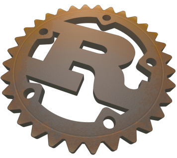

# 3D Rust Logo Model

A 3D model of the official Rust logo in the form of a Blender file.

The Rust logo is a trademark of Mozilla and the images the model is based on are CC-BY licensed.
This contents of the Blender file are also CC-BY licensed.
See [https://www.rust-lang.org/en-US/legal.html]() for what usages Mozilla allows.

# Example renders

The Blender file contains the settings for both of the following renders.

